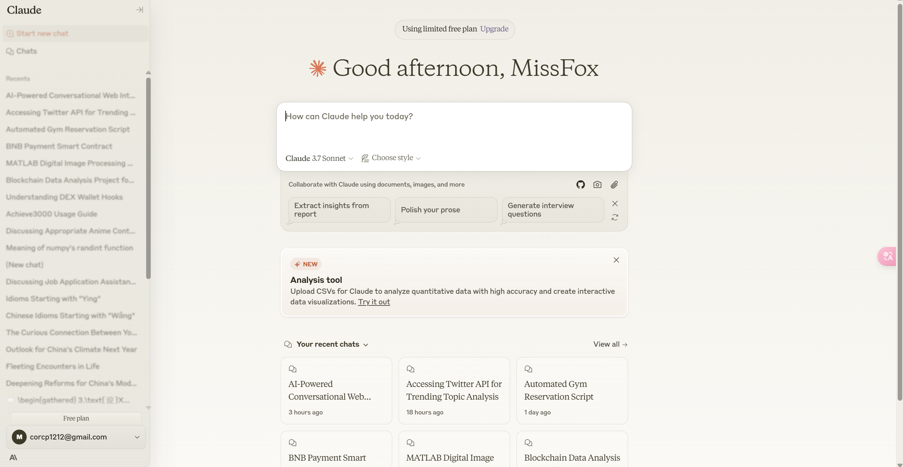

# DeepSeek AI 聊天应用

一个基于 DeepSeek 模型的 AI 聊天应用，具有简洁的 Claude 风格界面、聊天历史记录和推荐问题功能。



## 功能特点

- 📝 干净简洁的用户界面，专注于聊天体验
- 📚 聊天历史记录保存和浏览
- 💡 推荐问题快速启动对话
- 🔄 实时聊天响应
- 🌐 基于 DeepSeek-r1-250120 模型

## 技术栈

- **前端**: React, TypeScript, Tailwind CSS, shadcn/ui
- **后端**: Node.js, Express, Python Flask
- **AI模型**: DeepSeek-r1-250120 (火山方舟 Ark API)

## 应用架构

该应用采用混合架构:
- Node.js/Express 服务器处理前端请求和基本 API
- Python Flask 服务处理与火山方舟 API 的通信

## 本地安装与运行

### 前提条件

- Node.js (v16 或更高版本)
- npm (v7 或更高版本)
- Python 3.7 或更高版本
- pip (Python 包管理器)
- 火山方舟API密钥 (用于访问 DeepSeek 模型)

### 获取火山方舟API密钥

1. 访问火山方舟官网并创建账户
2. 申请访问 DeepSeek-r1-250120 模型
3. 生成 API 密钥并保存

### 方法一：使用自动脚本（推荐）

我们提供了一个自动化脚本，简化本地安装和运行过程:

1. 克隆存储库到本地机器
   ```bash
   git clone <repository-url>
   cd <repository-folder>
   ```

2. 设置环境变量
   ```bash
   # Linux/Mac
   export ARK_API_KEY=your_api_key_here

   # Windows (CMD)
   set ARK_API_KEY=your_api_key_here

   # Windows (PowerShell)
   $env:ARK_API_KEY="your_api_key_here"
   ```

3. 使脚本可执行并运行
   ```bash
   # Linux/Mac
   chmod +x start-local.sh
   ./start-local.sh

   # Windows
   # 请按照步骤4（方法二）中的说明手动运行
   ```

4. 打开浏览器访问: http://localhost:5000

### 方法二：手动安装和运行

如果自动脚本不适用于您的环境，可以按照以下步骤手动设置:

1. 克隆存储库到本地机器
   ```bash
   git clone <repository-url>
   cd <repository-folder>
   ```

2. 设置环境变量
   ```bash
   # Linux/Mac
   export ARK_API_KEY=your_api_key_here

   # Windows (CMD)
   set ARK_API_KEY=your_api_key_here

   # Windows (PowerShell)
   $env:ARK_API_KEY="your_api_key_here"
   ```

3. 安装 Python 依赖
   ```bash
   pip install flask flask-cors requests
   ```

4. 安装 Node.js 依赖
   ```bash
   npm install
   ```

5. 在一个终端启动 Python API 服务
   ```bash
   # Linux/Mac
   python api_service.py

   # Windows
   python api_service.py
   ```

6. 在另一个终端设置 Python API URL 并启动 Node.js 应用
   ```bash
   # Linux/Mac
   export PYTHON_API_URL=http://localhost:5001
   npm run dev

   # Windows (CMD)
   set PYTHON_API_URL=http://localhost:5001
   npm run dev

   # Windows (PowerShell)
   $env:PYTHON_API_URL="http://localhost:5001"
   npm run dev
   ```

7. 打开浏览器访问: http://localhost:5000

## 在 Windows 上运行

在 Windows 上运行应用时，请注意以下几点:

1. 使用正确的 Python 命令
   - 可能需要使用 `python` 或 `py` 命令，取决于安装
   - 确保 Python 已添加到 PATH 环境变量

2. 环境变量设置
   - CMD: 使用 `set VARIABLE=value`
   - PowerShell: 使用 `$env:VARIABLE="value"`

3. 运行多个终端
   - 您需要打开两个终端窗口:
     - 一个用于 Python Flask 服务 (api_service.py)
     - 一个用于 Node.js Express 应用 (npm run dev)

## 常见问题解决

### Python API 服务无法启动

1. 确认 Python 已正确安装
   ```bash
   python --version  # 或 python3 --version
   ```

2. 确认 Flask 已安装
   ```bash
   pip list | grep flask
   ```

3. 检查端口 5001 是否被占用
   ```bash
   # Linux/Mac
   lsof -i :5001

   # Windows
   netstat -ano | findstr :5001
   ```

### Node.js 应用无法连接到 Python 服务

1. 确认 Python 服务正在运行
   ```bash
   # Linux/Mac
   curl http://localhost:5001/health

   # Windows
   Invoke-WebRequest -Uri http://localhost:5001/health  # PowerShell
   ```

2. 检查 PYTHON_API_URL 环境变量是否正确设置
   ```bash
   # Linux/Mac
   echo $PYTHON_API_URL

   # Windows (CMD)
   echo %PYTHON_API_URL%

   # Windows (PowerShell)
   echo $env:PYTHON_API_URL
   ```

### AI 回复未生成

1. 确认 ARK_API_KEY 环境变量已正确设置
   ```bash
   # Linux/Mac
   echo $ARK_API_KEY

   # Windows (CMD)
   echo %ARK_API_KEY%

   # Windows (PowerShell)
   echo $env:ARK_API_KEY
   ```

2. 确认您有权访问 DeepSeek-r1-250120 模型
3. 检查 Python API 服务日志中是否有错误

## 生产部署注意事项

在生产环境中部署时，请注意:

1. 使用适当的 WSGI 服务器运行 Flask 应用，如 Gunicorn 或 uWSGI
2. 使用环境变量管理敏感信息，如 API 密钥
3. 考虑为 Python API 服务和 Node.js 应用配置反向代理
4. 实现请求速率限制以避免超出 API 限额

## 许可证

[您的许可证信息]